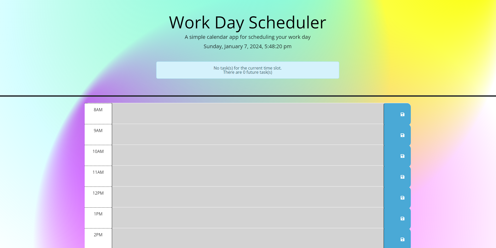
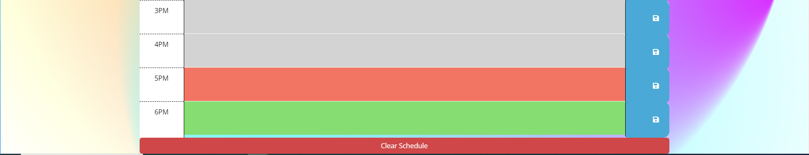
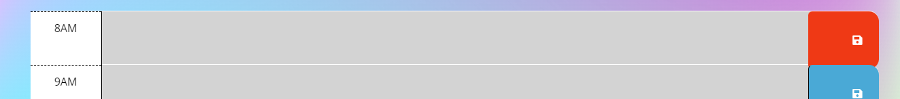

# Workday Scheduler

## Description 

This web application is a simple daily scheduler i designed for a challenge in a front-end developer bootcamp I'm curently attending.  

* Each time-block is colour-coded according to whether the time is in the past , present , or future .
* Users can save events by inputting text in a time-block and then clicking the save button on the right.
* Events can be removed by deleting text and then clicking the save button, or by clearing all schedule button on the bottom page.  
* There is also a box on top, displaying the current event , or if there are any future events/ or none.
* Buttons on the left will turn red to indicate saving the data.

    
    
    
    

## Screenshots

Press the red button " Clear schedule "  to delete all user data

Save button will turn red for 1-2 seconds to show it is saving.

# Links
## [Link to deployed application](https://fishmon.github.io/ScheduleMyWorkDay/)

## [Link to repository ](https://github.com/fishmon/ScheduleMyWorkDay)

